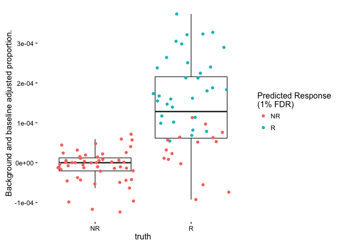
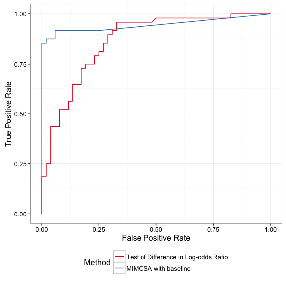

ICS Modeling with baseline
================
Greg Finak <greg@ozette.com>

<!-- README.md is generated from README.Rmd. Please edit that file -->
Background
==========

MIMOSA2 is an extension of the [http://github.com:RGLab/MIMOSA](MIMOSA) package for modeling immune responses to antigen stimulate using intracellular cytokine staining data.

Input data are cell counts from ICS flow cytometry experiments. Specifically, the number of cytokine positive cells, and the total number of cells.

Package usage is described below.

Usage
=====

``` r
library(MIMOSA2)
library(data.table)
library(ggplot2)
```

We simulate from the model.

``` r
set.seed(100)
s = simulate_MIMOSA2(effect=2e-4, baseline_stim_effect=5e-5,baseline_background = 2e-5,bg_effect =2e-5,phi=c(50000,50000,50000,50000),P=100,rng=c(120000,150000))
```

`s` is a `list` with components Ntot, ns0, ns1, nu0, nu1, truth. `Ntot` is a matrix with column names "ns1" "nu1" "ns0" and "nu0". These correspond to the total T-cell counts for stimulated (ns) and non-stimulated (nu) conditions at time 0 and time 1 (pre-vaccine and post-vaccine, respectively). "ns0" through "nu1" are the positive cell counts. `truth` is the true model component producing each observation. There are eight different components in the model, each represents a different configuration of observed counts, producing either response, non-response, or non-specific response.

We fit the model with the `MIMOSA2` modeling function.

``` r
fit = with(s, MIMOSA2(Ntot=Ntot,ns1=ns1,nu1=nu1,ns0=ns0,nu0=nu0,tol=1e-5))
```

The output of MIMOSA2 is a list with components z, inds, pi\_est, thetahat, ps1\_hat, ps0\_hat, pu1\_hat, pu0\_hat, Ntot, ns1, nu1, ns0, nu0. "z" is matrix with the probability that each observation arises from each component. "inds" holds the hard assignment of each observation to each model component.

The confusion matrix from the model fit is shown below. There is some confusion between the responder model components, and between the non-responder model components. However, discrimination of responders from non-responders is generally good, which is the important part.

``` r
table(fit=c("R1","R2","R3","R4","NR1","NR2","NR3","NSR","NSR2","NSR3","NSR4")[max.col(fit$z)],truth = s$truth)
#>       truth
#> fit    NR1 NR2 NR3 NSR R1 R2 R3 R4
#>   NR1    7   0   4   2  0  1  0  0
#>   NR2    1   8   2   1  0  0  0  0
#>   NR3    6   0   7   2  0  0  0  0
#>   NSR4   0   0   0  11  0  0  5  0
#>   R1     0   0   0   0  4  0  0  7
#>   R2     0   0   0   0  1  5  1  5
#>   R3     0   0   0   1  0  0 10  0
#>   R4     0   0   0   0  0  1  0  8
```

We plot the empirical proportions from stimulated and non-stimulated samples at each timepoint, conditioning the true response status.

``` r
p = with(s, {
  p = do.call(cbind, mget(colnames(Ntot))) / Ntot
  colnames(p) = c("pu1", "ps1", "pu0", "ps0")
  data.frame(p, truth=truth%like%"^R")
})
ggplot(melt(p, value.var = c("pu1", "ps1", "pu0", "ps0"))) +
  geom_boxplot(outlier.color = NA) +
  facet_wrap( ~ variable) +
  geom_jitter() +
  aes(x = truth, y = value)+theme_classic()
```


Here we show the empirical background-corrected and baseline-subtracted proportions.

``` r
ggplot(data.frame(p,ns1=s$ns1))+
  geom_boxplot(outlier.color=NA)+
  geom_jitter(aes(col=getResponse(fit,threshold=0.01)))+
  aes(x=truth,y=ps1-pu1-ps0+pu0)+
  scale_color_discrete("Predicted Response\n(1% FDR)",labels=c("NR","R")) +
  theme_classic() +
  scale_x_discrete(labels=c("NR","R")) +
  scale_y_continuous("Background and baseline adjusted proportion.")
```



We can generate ROCs comparing MIMOSA2 positivity calls against a test for a difference in log-odds ratios. The ROC curves show that MIMOSA2 performs better than a one-sided test for a difference in log-odds ratios.

``` r
ortest = with(s,ORTest(Ntot,ns1,nu1,ns0,nu0))

toplot = ROC(or_test=ortest, fit=fit,truth=s$truth%like%"^R")
ROCPlot(toplot)+guides(color=guide_legend(nrow=2))
```



MIMOSA2 also provides better control of the nominal false discovery rate.


